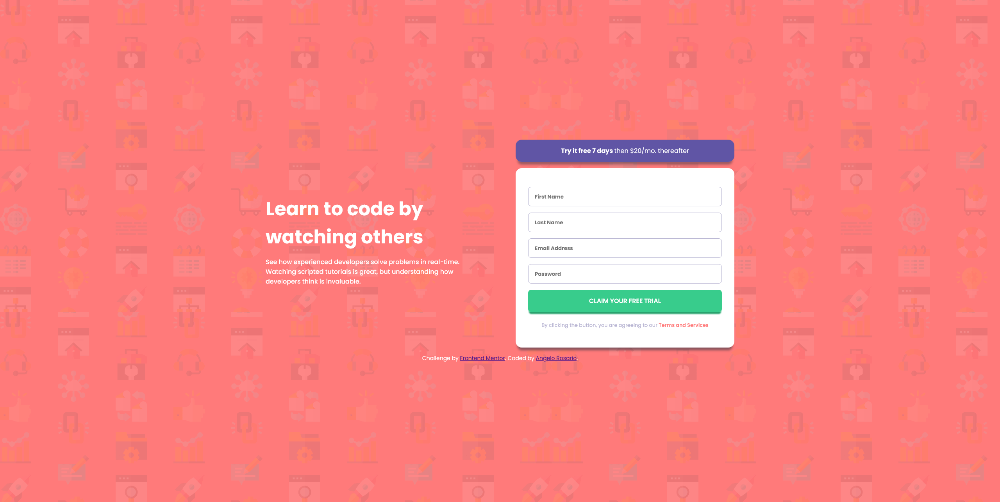

# Frontend Mentor - Intro component with sign up form solution

This is a solution to the [Intro component with sign up form challenge on Frontend Mentor](https://www.frontendmentor.io/challenges/intro-component-with-signup-form-5cf91bd49edda32581d28fd1). Frontend Mentor challenges help you improve your coding skills by building realistic projects. 

## Table of contents

- [Overview](#overview)
  - [The challenge](#the-challenge)
  - [Screenshot](#screenshot)
  - [Links](#links)
- [My process](#my-process)
  - [Built with](#built-with)
  - [What I learned](#what-i-learned)
  - [Continued development](#continued-development)
- [Author](#author)

## Overview

### The challenge

Users should be able to:

- View the optimal layout for the site depending on their device's screen size
- See hover states for all interactive elements on the page
- Receive an error message when the `form` is submitted if:
  - Any `input` field is empty. The message for this error should say *"[Field Name] cannot be empty"*
  - The email address is not formatted correctly (i.e. a correct email address should have this structure: `name@host.tld`). The message for this error should say *"Looks like this is not an email"*

### Screenshot




### Links

- Solution URL: [GitHub](https://github.com/Sengsith/react-signup-component)
- Live Site URL: [Netlify](https://your-live-site-url.com)

## My process

### Built with

- Semantic HTML5 markup
- CSS custom properties
- Flexbox
- CSS Grid
- Mobile-first workflow
- [React](https://reactjs.org/) - JS library
- [SASS](https://sass-lang.com/) - CSS Preprocessor


### What I learned

One thing I was able to practice with this project was creating inputs for a form dynamically by using an array of objects and passing them around using react components.

An example of what it would look like: 

```js
  const INPUTS = [{
    id: 1,
    name: "firstName",
    type: "text",
    placeholder: "First Name",
    errormessage: "First Name cannot be empty",
    required: true,
    // refer: userRef
  },...];
```

Afterwards, we pass the INPUTS into react components

```js
<Card INPUTS={INPUTS} ... />
```

Inside the container where we will have our dynamic input tags, we want to map out each one. The various properties of INPUTS can be passed by desstructuring each object as long as each name is the same:

```js
      {INPUTS.map(input => (
        <CardInput
        key={input.id}
        id={input.id}
        errormessage={input.errormessage}
        {...input} />
      ))}
```

### Continued development

I do want to learn optimal ways of accessing classes and ids and changing any styles that I need to. I believe that the approach I went with works, but is definitely the brute force method.

## Author

- Frontend Mentor - [@Sengsith](https://www.frontendmentor.io/profile/Sengsith)
